<div align="center">

# 🤖 AI Agent - Multi-purpose Intelligent Assistant


---

[](https://github.com/Kietnehi)
[](https://github.com/Kietnehi/AI-AGENT)
[](https://github.com/Kietnehi/AI-AGENT/fork)

</div>
<div align="center">
  
</div>

<div align="center">


</div>

<p align="center">
  
  
  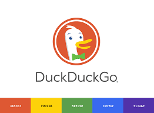
  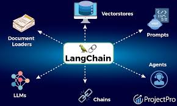
</p>
---

# 🤖 AI Agent - Multi-purpose Intelligent Assistant

## 📌 Introduction

> **⚠️ Note:** This repository is created to **test and experiment with various APIs**, as well as to **try out vibe coding for a simple AI Agent**.
> 
> In the future, more APIs will be added for testing and building during free time, so please don’t be too strict about it! 😊
> 
> This repository is used for testing and exploring additional functionalities, therefore it **does not belong to any specific scope**. It is simply about **exploring curious things that I have never done before**.
>
> **⭐ If you find this interesting, please support it by giving the repository a Star!**
<div align="center">

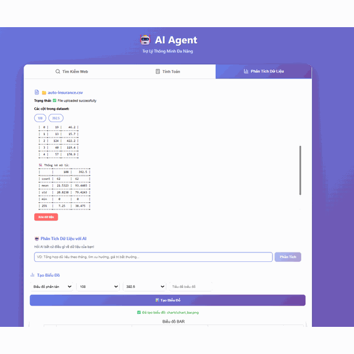

</div>

A powerful AI Agent with web search, mathematical computation, and data analysis capabilities, using the Gemini API as the primary LLM.

## Full Pipeline

<div align="center">
  
</div>

- **1. User Interface Layer:** Supports multiple input modalities: text, images, audio. Output is displayed in various formats: text, images, video, charts, audio. Integrated with `ngrok` for tunneling, enhancing security and remote accessibility.

- **2. Core Framework & Backend Layer:** Uses `FastAPI` as the main framework, along with `Pydantic` for data validation. The API server receives and processes requests. A `Smart Router` / Decision Maker routes requests to the appropriate AI service.

- **3. AI & Advanced Processing Layer:** The system integrates multiple AI tools by domain:
  - **LLM & Logic:** Google Gemini, Local LLM (Transformers, Ollama, ...)
  - **Image Processing (Vision AI):** Salesforce BLIP, OCR (EasyOCR / PaddleOCR)
  - **Audio Processing:** Speech-to-Text (Whisper), Text-to-Speech (gTTS)
  - **Search & Knowledge:** DuckDuckGo, SerpAPI, WolframAlpha
  - **Data Analysis:** Pandas, NumPy, Matplotlib, Plotly
  - **Multimedia Generation:** Text-to-Image (Clipdrop), Text-to-Video, Slide/Presentation generator
---

## 🗺️ Features Overview

This section provides a comprehensive look at the AI Agent's multi-tasking capabilities, ranging from advanced language processing and computer vision to deep data analysis.

<div align="center">
  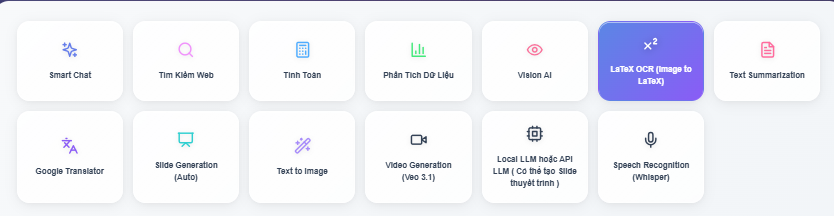
  <p><em>Central control interface featuring 13 core functional modules</em></p>
</div>

### 🚀 Core Functional Pillars:

* **🧠 Intelligence & Reasoning:**
    * **Smart Chat**: Intelligent messaging that automatically analyzes intent and triggers the appropriate tools.
    * **Local/API LLM**: Flexible switching between local models (Qwen) and cloud APIs (Gemini) for content and slide generation.
    * **Text Summarization**: Efficiently condenses long documents and complex texts into concise summaries.

* **👁️ Computer Vision & OCR:**
    * **Vision AI**: Analyzes image context to perform object recognition and Visual Question Answering (VQA).
    * **LaTeX OCR (Image to LaTeX)**: Specialized tool for converting mathematical formulas in images into precise LaTeX code.

* **🔍 Search & Computation:**
    * **Web Search**: Real-time information retrieval powered by DuckDuckGo and SerpAPI.
    * **Computation**: Solves complex mathematical problems and renders function plots via WolframAlpha.

* **📊 Analysis & Multimedia Creation:**
    * **Data Analysis**: Processes CSV/Excel files with automated statistical analysis and data visualization.
    * **Text to Image**: Generates high-quality artistic images from text prompts using the Clipdrop API.
    * **Video Generation (Veo 3.1)**: Creates cinematic short videos based on user descriptions.

* **🌐 Language & Audio:**
    * **Google Translator**: High-accuracy translation across 100+ languages.
    * **Speech Recognition (Whisper)**: High-precision Speech-to-Text conversion using OpenAI Whisper.
    * **Slide Generation (Auto)**: Automatically creates professional PowerPoint presentations from input documents.

---
## 🐳 Installation & Running with Docker

> **💡 Recommendation:** Use Docker for fast deployment and to avoid environment and dependency issues!

### 📦 Docker Images & Containers

After a successful build, the system will have the following Docker images and containers:

<p align="center">
  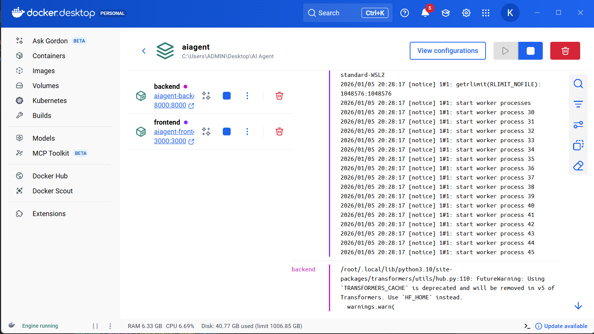
</p>

<p align="center">
  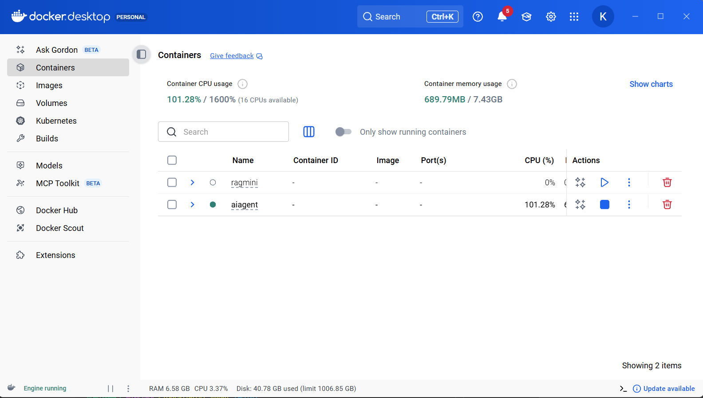
</p>

<p align="center">
  <em>Figure: Docker image (top) and Docker container (bottom) of the AI Agent system</em>
</p>

### 🚀 Quick Start with Docker

#### **Step 1: Install Docker**

- **Windows/Mac**: Download [Docker Desktop](https://www.docker.com/products/docker-desktop/)
- **Linux**: 
  ```bash
  curl -fsSL https://get.docker.com -o get-docker.sh
  sudo sh get-docker.sh
  ```

#### **Step 2: Configure API Keys**

Create a `.env` file in the `backend/` directory:

```env
GEMINI_API_KEY=your_gemini_api_key_here
WOLFRAM_APP_ID=your_wolfram_app_id_here
SERPAPI_KEY=your_serpapi_key_here
SEARCH_ENGINE=duckduckgo
```

#### **Step 3: Build and Run**

```bash
# Build and start all services
docker-compose up --build

# Or run in the background
docker-compose up -d --build
```

#### **Step 4: Access the Application**

- 🌐 **Frontend**: http://localhost:3000
- 🔧 **Backend API**: http://localhost:8000
- 📚 **API Docs**: http://localhost:8000/docs
#### **Useful Docker Commands:**

```bash
# View logs
docker-compose logs -f

# Stop services
docker-compose down

# Rebuild a specific service
docker-compose up -d --build frontend
docker-compose up -d --build backend

# View container status
docker ps
```

### 💡 Docker Optimization

- **BuildKit**: Build 2–3x faster
  ```bash
  # Windows PowerShell
  $env:DOCKER_BUILDKIT=1
  docker-compose build
  
  # Linux/Mac
  DOCKER_BUILDKIT=1 docker-compose build
  ```

- **Models Cache**: Models are stored in Docker volumes, no need to re-download:
  - `huggingface_cache`: Contains Qwen, BLIP models (~2–3GB)
  - `paddleocr_cache`: Contains PaddleOCR models (~10MB)  
  - `easyocr_cache`: Contains EasyOCR models (~100MB)

📖 **Docker optimization details**: See [README_DOCKER.md](README_DOCKER.md) to learn more about multi-stage builds, layer caching, and optimization tips.

---

## ✨ Features

### 🌟 Smart Chat AI (Real-time)
- **Intelligent chat** with AI that automatically decides when to search
- **Question analysis** and automatic real-time information search when needed
- **Synthesis & recommendations** based on search results
- **Natural conversation** in Vietnamese
- **📸 Image Upload/Paste**: Send images along with messages for AI analysis (maximum 5 images per message)
  - **Direct paste**: Copy image (Ctrl+C) → Paste into chat box (Ctrl+V)
  - **Drag & Drop**: Drag and drop image files into the textarea
  - **Click upload**: Click the 📷 button to select files from your device

<div align="center">

<table style="width:100%; border-collapse:collapse;">
  <tr>
    <th style="width:50%; padding:16px; font-size:18px;">
      Smart Chat AI Interface
    </th>
    <th style="width:50%; padding:16px; font-size:18px;">
      Paste/Upload Image Feature
    </th>
  </tr>
  <tr>
    <td style="padding:16px;">
      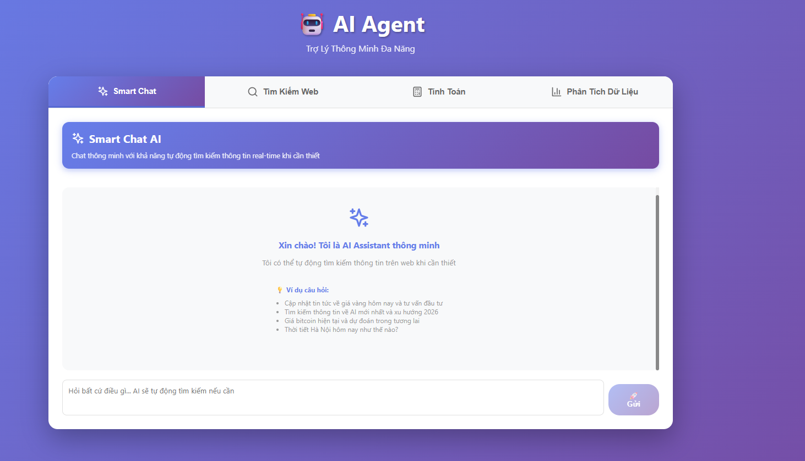
    </td>
    <td style="padding:16px;">
      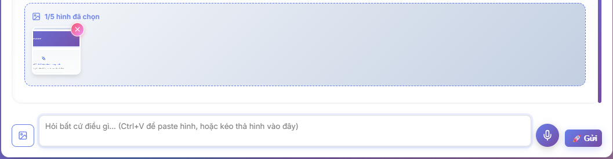
    </td>
  </tr>
</table>

<p style="margin-top:12px; font-style:italic; font-size:15px;">
  Figure: (Left) Smart Chat interface with automatic real-time search — (Right) Paste/Upload images (up to 5 images) supporting multimodal AI
</p>

</div>

### 1. 🔍 Web Search
- **DuckDuckGo**: Free and privacy-focused search
- **SerpAPI**: Google Search with API key
- Users can choose the appropriate search engine

<p align="center">
  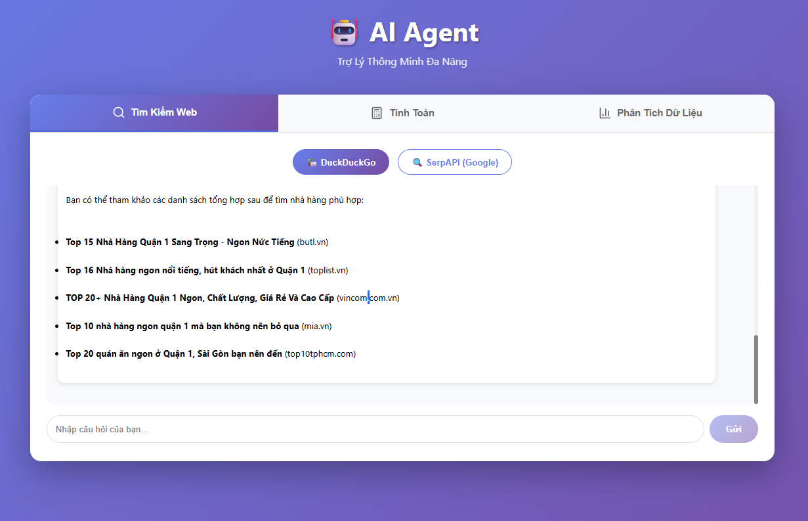
  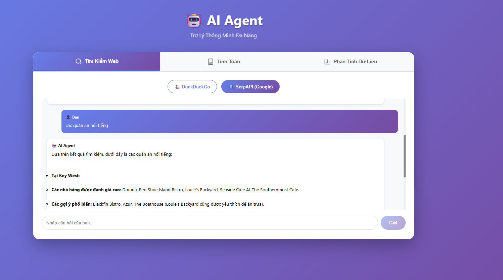
</p>

### 2. 🧮 Mathematical Computation
- Uses **Wolfram Alpha API**
- Solve complex math problems, integrals, derivatives
- Scientific and statistical calculations
- Equation solving
- **Function plotting** directly from Wolfram Alpha

<div align="center">

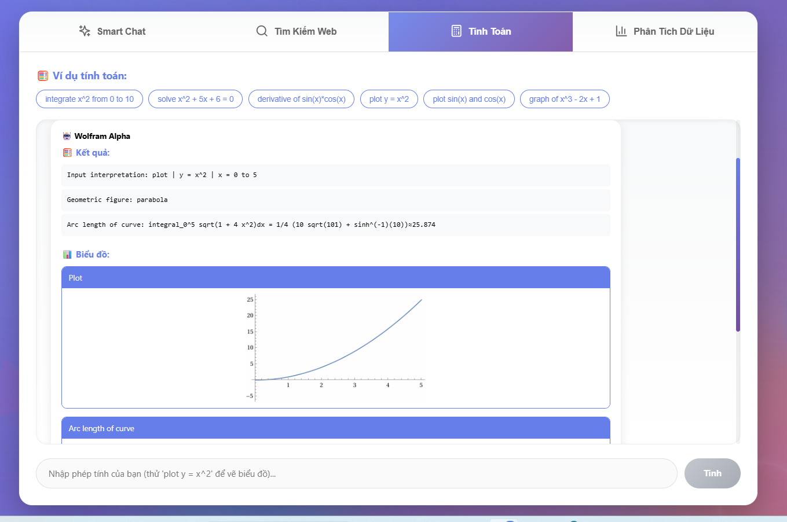
*Function plot generated by Wolfram Alpha API*

</div>

**Advanced plotting feature:** The AI Agent integrates directly with the Wolfram Alpha API to generate accurate and visually appealing mathematical plots. Simply enter commands such as "plot y = x^2" or "graph sin(x) from -π to π", and the system will automatically send requests to Wolfram Alpha, receive high-quality plot images, and display them instantly in the interface. Wolfram Alpha handles complex visualizations including multivariable functions, 3D plots, polar charts, and special functions, helping users visualize mathematics easily and professionally.

### 3. 📊 Data Analysis
- Read and analyze CSV files
- Detailed descriptive statistics
- Generate multiple types of charts:
  - Bar chart
  - Line chart
  - Scatter plot
  - Histogram
  - Pie chart
  - Box plot
  - Heatmap

<div style="display: flex; justify-content: center; gap: 20px;">
  <div style="flex: 1; text-align: center;">
    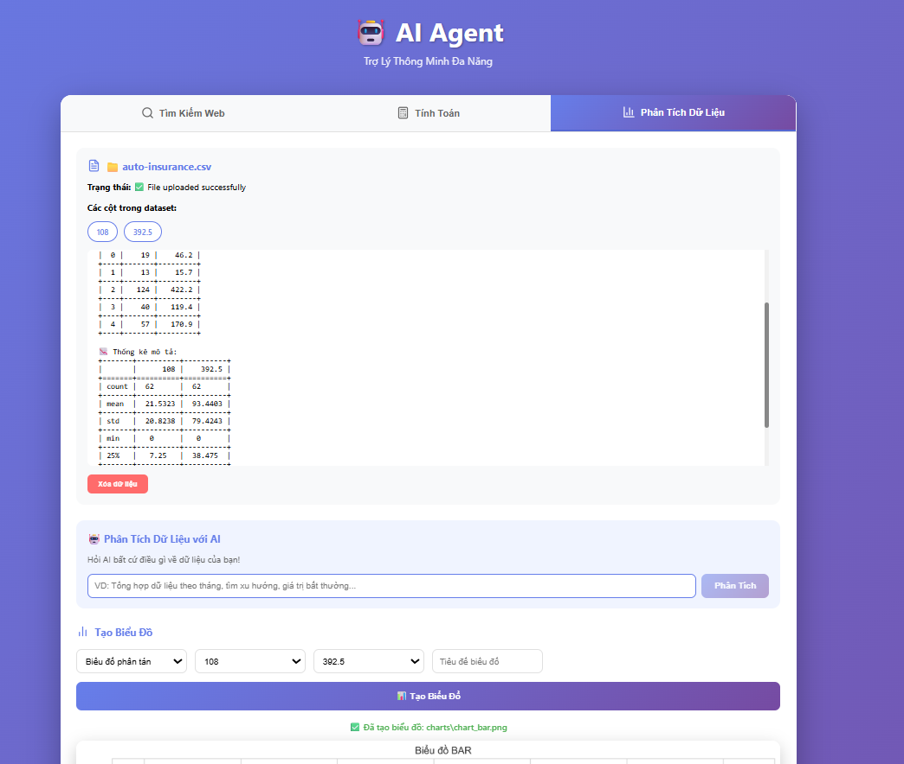
    <p><em>Data analysis interface</em></p>
  </div>

  <div style="flex: 1; text-align: center;">
    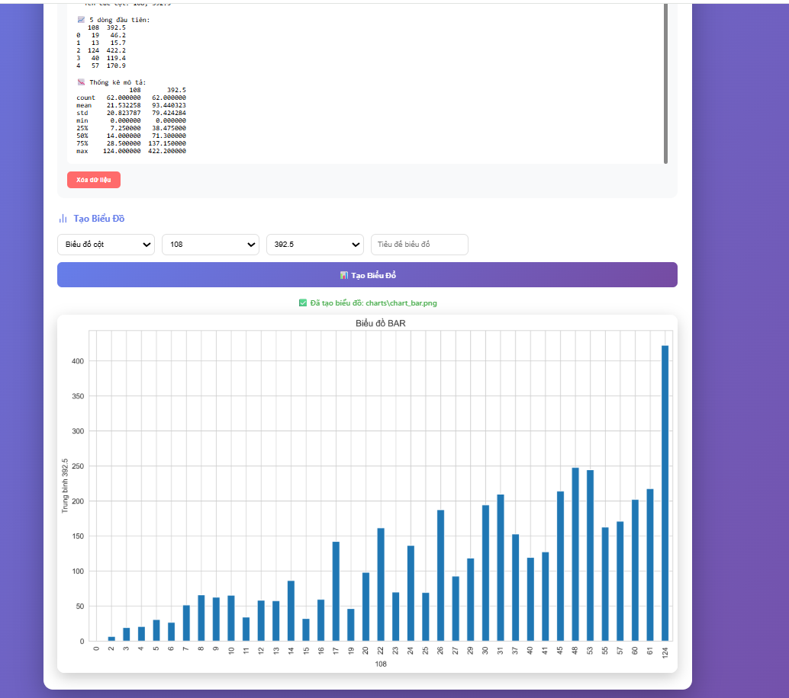
    <p><em>Automatically generated bar chart</em></p>
  </div>
</div>

### 4. 🧠 Gemini LLM
- Uses the Google Gemini API
- Intelligent question answering
- Understands conversational context
- Natural interaction in Vietnamese

### 5. 🔊 Audio Player (Text-to-Speech)

- **Overview:** The AI Agent currently supports Text-to-Speech (TTS) and plays audio directly in the web interface. This feature allows you to listen to answers, notes, or data analysis results without reading manually.

- **Main features:**
  - Play / Pause: start or pause audio playback.
  - Seek: click on the progress bar to jump to a desired position.
  - Time display: shows current time and total duration (e.g., 0:10 / 2:27).
  - Restart: replay audio from the beginning.
  - User-friendly UI with hover hints indicating seek capability.

- **Code locations:**
  - Frontend component: [frontend/src/components/AudioButton.js](frontend/src/components/AudioButton.js)
  - Backend endpoint (text-to-speech): [backend/main.py](backend/main.py#L465)

- **Quick usage guide:**
  1. Wherever the "Listen" button or speaker icon appears, click it to download and play the audio.
  2. Use the progress bar to seek (click) or use Pause/Resume.
  3. Press the ↻ button to restart playback.

- **Technical notes:**
  - The frontend calls the `/text-to-speech` API to receive an audio file (MPEG), creates a temporary URL (`URL.createObjectURL`), and plays it using the browser’s `Audio` element.
  - To change voices or TTS parameters, modify the TTS configuration in `backend/main.py` where `gTTS` is called (or replace it with another TTS service).

### Speech-to-Text (Voice Input)

- **Short description:** Record audio from the microphone, convert speech to text, and automatically fill it into the chat input.

- **Locations:** `frontend/src/components/MicrophoneButton.js`, `backend/tools/speech_to_text.py`, endpoint `/speech-to-text` in `backend/main.py`.

- **Quick guide:** Click the microphone → speak → stop → review/edit text → send.

- **Notes:** The browser must support `MediaRecorder`. For higher accuracy, configure the backend to use Whisper or a cloud-based STT service.

### 6. 🎤 Automatic Speech Recognition (ASR) — Whisper AI

- **Overview:** The AI Agent integrates **OpenAI Whisper**, a powerful ASR model capable of automatic language detection and accurate speech-to-text conversion. Whisper supports 90+ languages and can automatically translate speech into English, making it suitable for multilingual applications.

- **Key features:**
  - **Automatic Transcription:** Automatically detects the spoken language and converts speech to text
  - **Multi-language Support:** Supports 90+ languages (Vietnamese, English, Japanese, Korean, Chinese, French, German, etc.)
  - **Auto-translate to English:** Automatically translates any language into English
  - **High Accuracy:** Performs well even with accents and background noise
  - **Multiple Model Sizes:** Supports multiple model sizes (tiny, base, small, medium, large)
  - **Real-time Processing:** Fast processing with streaming audio

<div align="center">

<table style="width:100%; border-collapse:collapse;">
  <tr>
    <th style="width:50%; padding:16px; font-size:18px;">
      Auto Transcribe (All Languages)
    </th>
    <th style="width:50%; padding:16px; font-size:18px;">
      Translate to English
    </th>
  </tr>
  <tr>
    <td style="padding:16px;">
      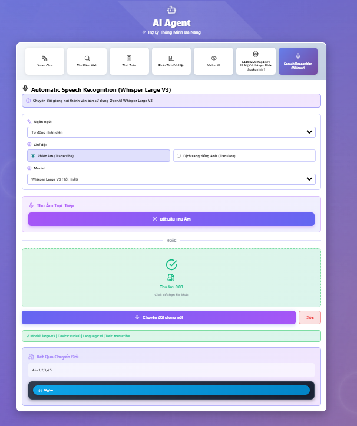
    </td>
    <td style="padding:16px;">
      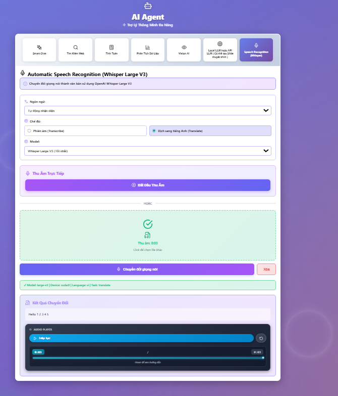
    </td>
  </tr>
</table>

<p style="margin-top:12px; font-style:italic; font-size:15px;">
  Figure: (Left) Automatic transcription for all languages — (Right) Transcription with English translation
</p>

</div>

- **Operating modes:**

  **1. Auto Transcribe Mode**
  - Automatically detects the spoken language
  - Converts speech to text in the original language
  - Suitable for notes, subtitles, meeting transcription

  **2. Translate Mode**
  - Detects the source language
  - Transcribes and automatically translates into English
  - Suitable for real-time translation and international communication

- **Whisper model comparison:**

| Model | Size | Speed | Accuracy | RAM/VRAM | Use case |
|------|------|-------|----------|----------|----------|
| **tiny** | ~40MB | ⭐⭐⭐⭐⭐ Very fast | ⭐⭐⭐ Medium | ~1GB | Demo, testing |
| **base** | ~75MB | ⭐⭐⭐⭐ Fast | ⭐⭐⭐⭐ Good | ~1GB | Lightweight production |
| **small** | ~240MB | ⭐⭐⭐ Medium | ⭐⭐⭐⭐ Good | ~2GB | Recommended |
| **medium** | ~770MB | ⭐⭐ Slow | ⭐⭐⭐⭐⭐ Very good | ~5GB | High quality |
| **large** | ~1.5GB | ⭐ Very slow | ⭐⭐⭐⭐⭐ Best | ~10GB | Professional |

- **Python usage example:**

```python
import whisper

# Load model (choose size based on resources)
model = whisper.load_model("base")  # tiny, base, small, medium, large

# 1. Auto Transcribe (keep original language)
result = model.transcribe("audio.mp3")
print(f"Detected Language: {result['language']}")
print(f"Text: {result['text']}")

# 2. Translate to English
result = model.transcribe("audio.mp3", task="translate")
print(f"English Translation: {result['text']}")

# 3. Streaming audio example
import sounddevice as sd
import numpy as np

duration = 5  # seconds
fs = 16000
audio = sd.rec(int(duration * fs), samplerate=fs, channels=1)
sd.wait()

result = model.transcribe(audio.flatten())
print(result['text'])
```

- **Real-world use cases:**
  - **Conference transcription:** Multilingual meeting transcription
  - **Video subtitles:** Automatic subtitles for YouTube, TikTok
  - **Accessibility:** Real-time speech-to-text for the hearing impaired
  - **Language learning:** Pronunciation practice and transcription comparison
  - **Customer support:** Call recording and analysis
  - **Medical notes:** Transcribing diagnoses and clinical notes
  - **Interviews & journalism:** Automatic note-taking and transcription

- **Code locations:**
  - Backend tool: [backend/tools/asr_tool.py](backend/tools/asr_tool.py)
  - Backend endpoints: [backend/main.py](backend/main.py) — `/asr-transcribe`, `/asr-translate`
  - Frontend component: [frontend/src/components/ASRFeature.js](frontend/src/components/ASRFeature.js)

- **Technical notes:**
  - **GPU Acceleration:** Whisper runs 5–10x faster on GPU (CUDA)
  - **Model Loading:** First use downloads the model (~40MB–1.5GB depending on size)
  - **Audio Formats:** Supports MP3, WAV, M4A, FLAC, OGG
  - **Max Audio Length:** Unlimited, but long audio (>30 minutes) should be chunked
  - **Noise Handling:** Handles background noise well; high-quality audio yields better results
  - **Fine-tuning:** Can be fine-tuned for specific accents or domains
  - **API Alternative:** Use OpenAI Whisper API if you do not want to run locally

- **Performance optimization:**

```python
# 1. Use faster-whisper (up to 4x faster)
from faster_whisper import WhisperModel

model = WhisperModel("base", device="cuda", compute_type="int8")
segments, info = model.transcribe("audio.mp3")

# 2. Batch processing for multiple files
import concurrent.futures

def process_audio(file_path):
    return model.transcribe(file_path)

with concurrent.futures.ThreadPoolExecutor(max_workers=4) as executor:
    results = executor.map(process_audio, audio_files)

# 3. Streaming for real-time use
from faster_whisper import WhisperModel

model = WhisperModel("base", device="cuda")
# Stream audio chunks and transcribe in real time
```

- **Supported languages (Top 20):**
  - 🇻🇳 Vietnamese
  - 🇺🇸 English
  - 🇨🇳 Chinese
  - 🇯🇵 Japanese
  - 🇰🇷 Korean
  - 🇫🇷 French
  - 🇩🇪 German
  - 🇪🇸 Spanish
  - 🇷🇺 Russian
  - 🇮🇹 Italian
  - 🇵🇹 Portuguese
  - 🇹🇭 Thai
  - 🇮🇳 Hindi
  - 🇹🇷 Turkish
  - 🇵🇱 Polish
  - 🇳🇱 Dutch
  - 🇸🇪 Swedish
  - 🇮🇩 Indonesian
  - 🇸🇦 Arabic
  - ... and 70+ more languages

### 7. 🧩 Local Open-source LLM — QWEN 1.5B

- **Overview:** In addition to Gemini and cloud services, the AI Agent supports running small to medium open-source LLMs locally. The repository currently provides guidance for integrating `QWEN 1.5B`, a lightweight language model suitable for local experimentation on machines with a GPU or a strong CPU.

- **Features when using QWEN 1.5B:**
  - Run a local LLM for offline question answering (no third-party API key required).
  - Basic Vietnamese language support and customizable prompt handling.
  - Suitable for Local LLM experimentation, lightweight fine-tuning, and prototyping.

### 8. 📝 Text Summarization

- **Overview:** The AI Agent supports English text summarization using the `facebook/bart-large-cnn` model. This feature helps you quickly grasp key points from long documents.

- **Key features:**
  - Automatic English text summarization
  - Displays compression ratio
  - Shows original and summarized text lengths
  - Supports Text-to-Speech for summarized output
  - Automatically handles long text (truncates if exceeding limits)

- **Demo (image):**

  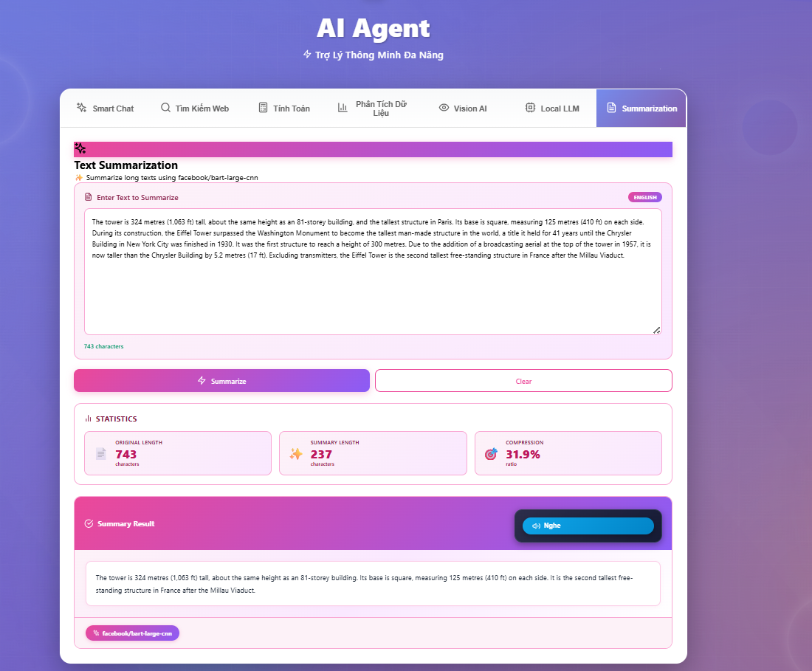

- **Code locations:**
  - Backend tool: [backend/tools/summarization_tool.py](backend/tools/summarization_tool.py)
  - Backend endpoint: [backend/main.py](backend/main.py) — `/summarization`
  - Frontend component: [frontend/src/components/SummarizationFeature.js](frontend/src/components/SummarizationFeature.js)

- **How to use:**
  1. Enter English text (minimum 50 characters)
  2. Click the "Summarize" button
  3. View the summarized result with detailed statistics
  4. Use the "Listen" button to hear the summary

- **Demo (images):**

  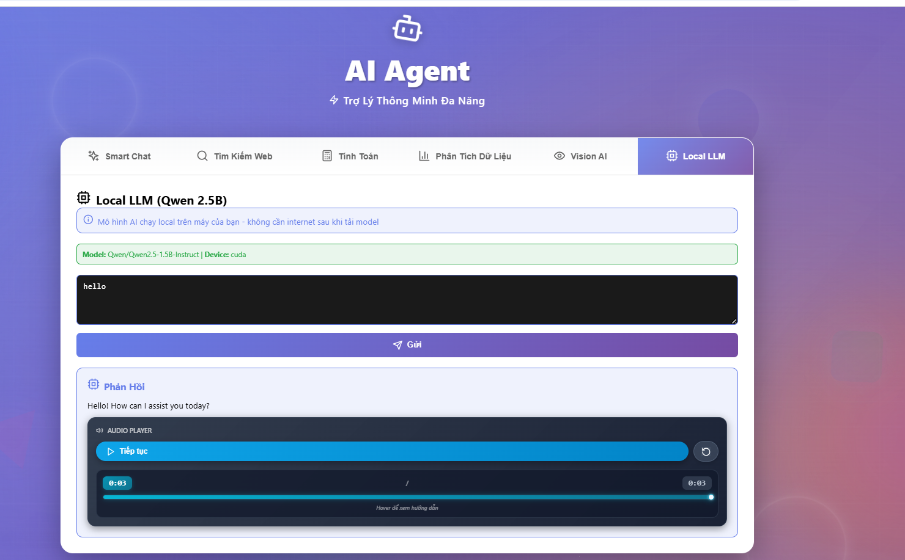

  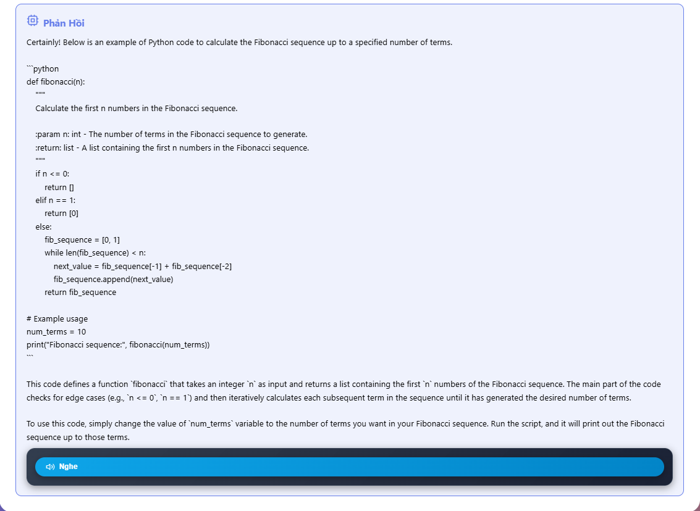
  *Local LLM Response — Example output from the Local LLM (QWEN 1.5B).*

- **Quick start guide:**
  1. Prepare the environment (Python ≥ 3.8, virtualenv). Install local model libraries (e.g., `transformers`, `accelerate`, or a suitable runtime).
  2. Download QWEN 1.5B weights or use a compatible mirror as instructed by QWEN developers.
  3. Run a local service (e.g., a small script or FastAPI endpoint) to load the model and respond to prompts.

  Minimal example:

  ```python
  # pseudo-example: loading with transformers (actual setup may require additional configuration)
  from transformers import AutoModelForCausalLM, AutoTokenizer

  tokenizer = AutoTokenizer.from_pretrained('qwen/Qwen2.5-1.5B')
  model = AutoModelForCausalLM.from_pretrained('qwen/Qwen2.5-1.5B')

  def ask_local(prompt):
      inputs = tokenizer(prompt, return_tensors='pt')
      outputs = model.generate(**inputs, max_length=512)
      return tokenizer.decode(outputs[0], skip_special_tokens=True)
  ```

- **Notes on output quality:**
  - When using small open-source models or low-bit quantization (e.g., 4-bit) to reduce model size and VRAM usage, output quality (accuracy, coherence, context understanding) may degrade compared to larger models or higher-precision inference.
  - If results are unsatisfactory, consider using a larger model, higher precision (FP16/FP32), or lower quantization levels if resources allow.

### Slide Generation

- **Description:** Automatic slide generation from a user-provided topic, using a Local LLM or an LLM API to generate content for each slide and export a presentation file.
- **Frontend location:** [frontend/src/components/LocalLLMFeature.js](frontend/src/components/LocalLLMFeature.js)
- **Backend:** The frontend calls a slide-generation endpoint (see `backend/main.py` for endpoint details and how the backend returns the PPTX file).

**Quick guide:**

1. Open the `Local LLM` interface in the web app.
2. Click the **Create Slides** button.
3. Enter the **topic** and desired **number of slides**.
4. Click **Create Slides** — wait for slide generation to finish, then click **Download Slides** to get the PPTX file.

**UI illustration (example):**

<div align="center">

  <!-- Slide Generation UI (standalone) -->
  <div style="margin-bottom:24px; max-width:900px;">
    <h3 style="margin-bottom:12px;">Slide Generation Interface</h3>
    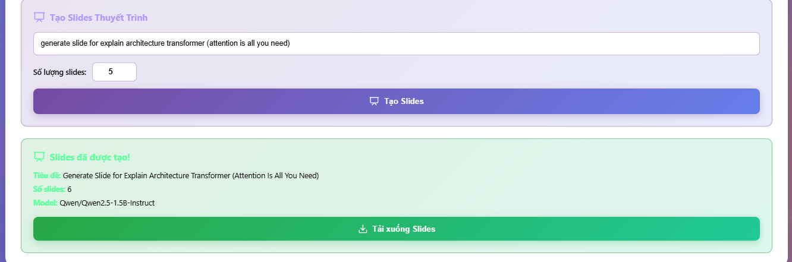
  </div>

  <!-- Two-column table -->
  <table style="width:100%; border-collapse:collapse;">
    <tr>
      <th style="width:50%; padding:16px; font-size:18px;">
        Example PPTX File
      </th>
      <th style="width:50%; padding:16px; font-size:18px;">
        Generated Slides
      </th>
    </tr>
    <tr>
      <td style="padding:16px;">
        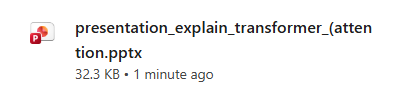
      </td>
      <td style="padding:16px;">
        
      </td>
    </tr>
  </table>

  <p style="margin-top:12px; font-style:italic; font-size:15px;">
    Figure: (1) Slide generation interface — (2) Example PPTX file — (3) Slides generated by the feature
  </p>

</div>


- **Technical & performance notes:**
  - `QWEN 1.5B` requires significant RAM/VRAM to load; without a strong GPU, CPU mode can be used but will be slow.
  - For better performance, consider using `bitsandbytes` with `8-bit`/`4-bit` quantization or deploying on a GPU-enabled machine.
  - When running locally, manage resources carefully and limit batch size and prompt length to avoid OOM errors.

- **Suggested integration locations:** Add a FastAPI endpoint in `backend/` to call the local model, and create a corresponding frontend feature in `frontend/src/components/LocalLLMFeature.js`.

### 9. 📄 Tạo Slide Từ Nhiều Tài Liệu Với GEMINI API

<div align="center" style="max-width:900px; margin: 24px auto 12px;">
  <h3 style="margin-top:20px; margin-bottom:8px;">Tạo Slide Từ Nhiều Tài Liệu Với GEMINI API</h3>
  <p style="color:#555; max-width:820px; margin:0 auto 12px;">
    Dùng GEMINI API để tự động tạo slide thuyết trình từ nhiều file <strong>.docx</strong> hoặc <strong>.pdf</strong>. 
    Người dùng có thể chọn số lượng slide muốn tạo, hệ thống sẽ phân tích nội dung và hình ảnh trong tài liệu, 
    sau đó tạo ra một tệp PowerPoint (.pptx) hoàn chỉnh kèm hình ảnh tương ứng.
  </p>

  <div style="display: flex; flex-wrap: wrap; gap: 20px; justify-content: center;">
<div style="flex: 1 1 300px; max-width: 400px; box-shadow: 0 6px 18px rgba(0,0,0,0.1); border-radius: 10px; overflow: hidden; background: #fff; border: 1px solid #eee; text-align: left;">
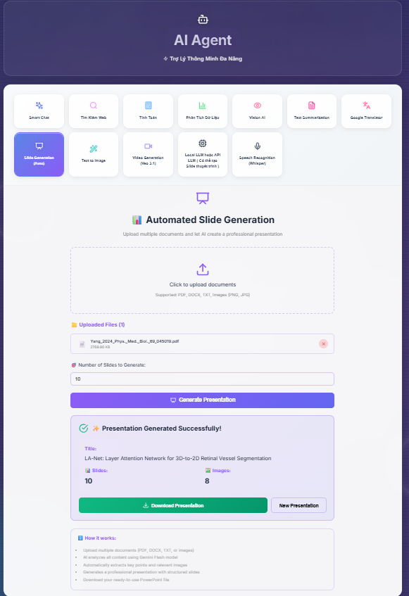
<div style="padding: 16px;">
<strong style="font-size: 16px; color: #222;">Upload nhiều tài liệu</strong>
<p style="font-size: 13px; color: #666; margin-top: 6px; line-height: 1.4;">Cho phép tải lên file .docx hoặc .pdf, hệ thống trích xuất nội dung và hình ảnh.</p>
</div>
</div>
<div style="flex: 1 1 300px; max-width: 400px; box-shadow: 0 6px 18px rgba(0,0,0,0.1); border-radius: 10px; overflow: hidden; background: #fff; border: 1px solid #eee; text-align: left;">
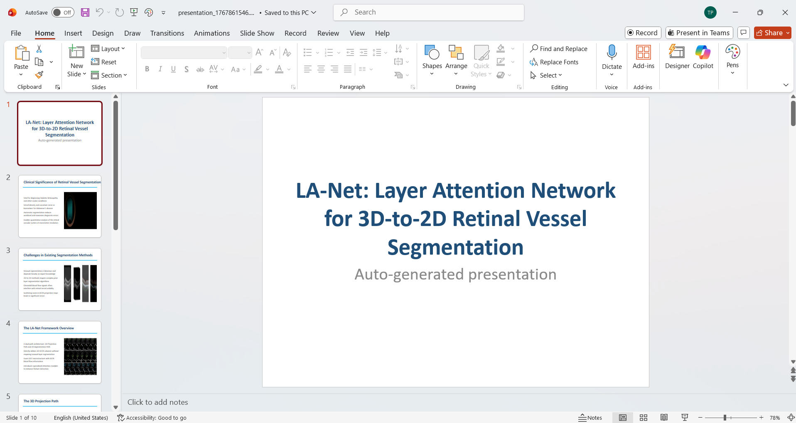
<div style="padding: 16px;">
<strong style="font-size: 16px; color: #222;">Kết quả: PowerPoint + Hình ảnh</strong>
<p style="font-size: 13px; color: #666; margin-top: 6px; line-height: 1.4;">Tệp .pptx được tạo tự động với số slide tùy chọn kèm hình ảnh tương ứng.</p>
</div>
</div>
  </div>
</div>

### 10. 👁️ Visual Question Answering (VQA)

- **Overview:** The AI Agent supports Visual Question Answering — the ability to answer questions based on image content. Using Salesforce’s BLIP (Bootstrapping Language-Image Pre-training) model, the system can understand and analyze images to provide accurate answers to user questions.

- **Key features:**
  - Answer questions about image content (object count, colors, positions, activities, etc.)
  - Detect and describe elements within images
  - Support multiple question types: “What”, “How many”, “Where”, “What color”, etc.
  - Process both local images and images from URLs

<div align="center">

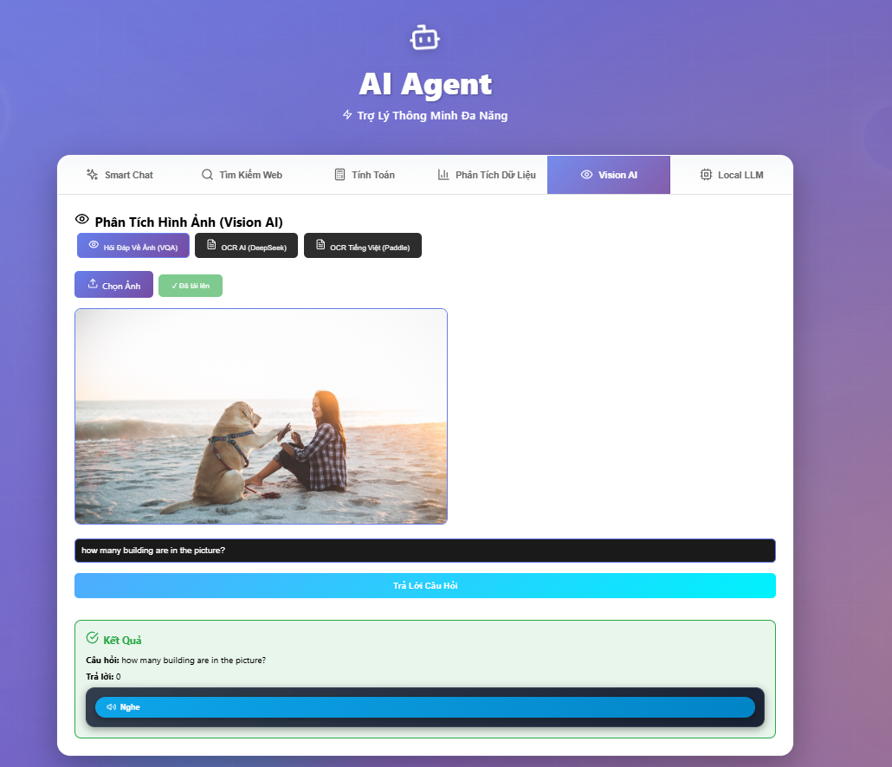
*Visual Question Answering interface with image analysis and question answering capabilities*

</div>

- **Models used:**
  - **BLIP-VQA-Base:** Vision-language model trained on large datasets
  - **Processor:** BlipProcessor for handling both image and text inputs
  - **Model:** BlipForQuestionAnswering for the VQA task

- **Usage example:**

```python
from PIL import Image
from transformers import BlipProcessor, BlipForQuestionAnswering

# Load model and processor
processor = BlipProcessor.from_pretrained("Salesforce/blip-vqa-base")
model = BlipForQuestionAnswering.from_pretrained("Salesforce/blip-vqa-base")

# Load image
image = Image.open("example.jpg").convert('RGB')

# Ask a question
question = "How many people are in the image?"
inputs = processor(image, question, return_tensors="pt")

# Get answer
output = model.generate(**inputs)
answer = processor.decode(output[0], skip_special_tokens=True)
print(f"Answer: {answer}")
```

- **Real-world use cases:**
  - Product image analysis in e-commerce
  - Assisting visually impaired users in understanding images
  - Quality inspection and object counting
  - Medical and educational image analysis
  - Automatic image tagging and classification

- **Code locations:**
  - Backend endpoint: [backend/tools/vision_tools.py](backend/tools/vision_tools.py)
  - Frontend component: [frontend/src/components/VisionFeature.js](frontend/src/components/VisionFeature.js)

- **Technical notes:**
  - GPU recommended for fast processing (CPU supported but slower)
  - Required libraries: `transformers`, `Pillow`, `torch`
  - Model size: ~990MB, downloaded on first use
  - Supports batch processing for multiple images

### 11. 📷 Image to Text — OCR (Optical Character Recognition)

- **Overview:** The AI Agent integrates two powerful OCR technologies to extract text from images: **EasyOCR** and **PaddleOCR**. This feature converts text in images into editable text and supports many languages including Vietnamese, English, and dozens more.

- **Key features:**
  - **Two powerful OCR engines:**
    - **EasyOCR:** Easy to use, supports 80+ languages
    - **PaddleOCR:** Fast and highly accurate
  - High-accuracy text extraction from images
  - Supports Vietnamese and many other languages
  - Handles mixed-language images
  - Recognizes printed and handwritten text (model-dependent)
  - Processes images from local files or URLs

<div align="center">

<p align="center">
  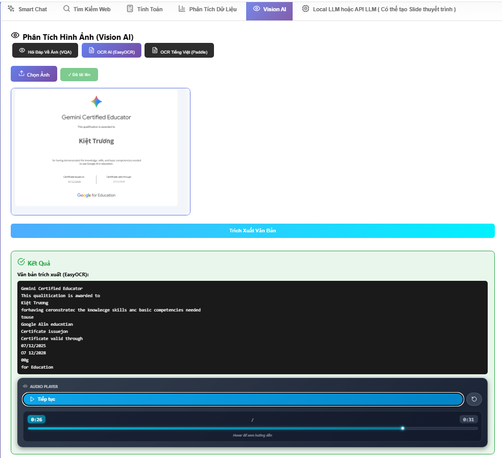
  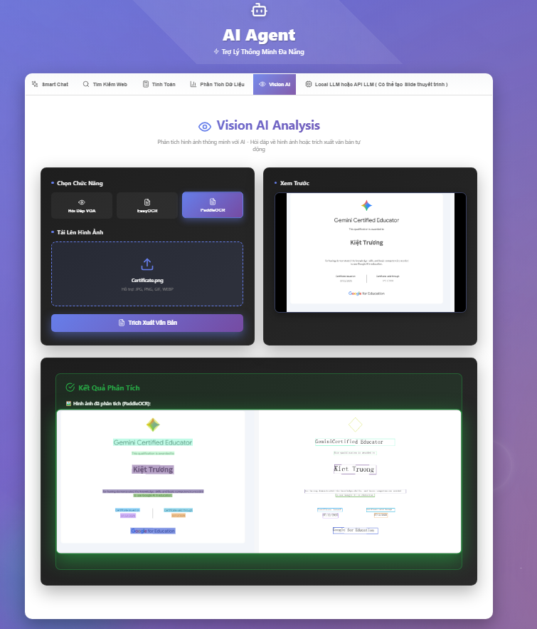
</p>

*OCR interface with two engines: EasyOCR (left) and PaddleOCR (right)*

</div>

- **EasyOCR vs PaddleOCR comparison:**

| Criteria | EasyOCR | PaddleOCR |
|--------|---------|-----------|
| **Ease of use** | ⭐⭐⭐⭐⭐ Very easy | ⭐⭐⭐⭐ Easy |
| **Speed** | ⭐⭐⭐ Medium | ⭐⭐⭐⭐⭐ Very fast |
| **Accuracy** | ⭐⭐⭐⭐ High | ⭐⭐⭐⭐⭐ Very high |
| **Language support** | 80+ languages | 80+ languages |
| **Vietnamese** | ✅ Good | ✅ Very good |
| **Model size** | ~100MB | ~10MB |
| **Installation** | Simple | Simple |

- **EasyOCR usage example:**

```python
import easyocr

# Initialize reader with Vietnamese and English
reader = easyocr.Reader(['vi', 'en'], gpu=True)

# Read text from image
results = reader.readtext('image.jpg')

# Display results
for (bbox, text, confidence) in results:
    print(f"Text: {text}")
    print(f"Confidence: {confidence:.2f}")
```

- **PaddleOCR usage example:**

```python
from paddleocr import PaddleOCR

# Initialize OCR with Vietnamese
ocr = PaddleOCR(lang='vi', use_angle_cls=True)

# Read text from image
result = ocr.ocr('image.jpg', cls=True)

# Display results
for line in result[0]:
    text = line[1][0]
    confidence = line[1][1]
    print(f"Text: {text}")
    print(f"Confidence: {confidence:.2f}")
```

- **Real-world use cases:**
  - Document digitization, invoices, receipts
  - Extracting information from business cards and ID cards
  - Reading text from signs and banners
  - Converting printed books and newspapers into digital text
  - Assisting visually impaired users
  - Automated data entry from forms

- **Code locations:**
  - Backend tool: [backend/tools/vision_tools.py](backend/tools/vision_tools.py)
  - Backend endpoint: [backend/main.py](backend/main.py) — `/ocr`
  - Frontend component: [frontend/src/components/VisionFeature.js](frontend/src/components/VisionFeature.js)

- **Technical notes:**
  - **EasyOCR:** Requires PyTorch; GPU (CUDA) recommended
  - **PaddleOCR:** Lightweight, runs well on CPU, GPU supported
  - First run downloads models (EasyOCR ~100MB, PaddleOCR ~10MB)
  - Best results with high-resolution, clear images
  - Supports batch OCR for multiple images
  - Confidence threshold can be adjusted to filter results

---

## 12. 📐 LaTeX OCR (Image to LaTeX Code)

### 📌 Overview
**LaTeX OCR** is an advanced feature that converts mathematical formulas and equations from images into LaTeX code automatically. Using the powerful **pix2tex** Docker container, the system can recognize handwritten or printed mathematical expressions and convert them into clean, editable LaTeX markup.

<div align="center" style="margin: 20px 0;">
  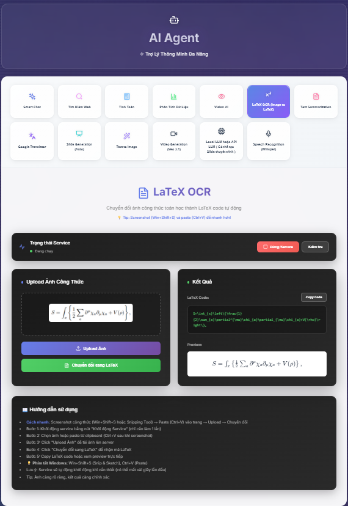
  <p style="margin-top: 10px; font-style: italic; color: #555;">
     <b>LaTeX OCR Interface</b> - Convert complex mathematical images to LaTeX code instantly
  </p>
</div>

### ✨ Key features
- **Automatic LaTeX conversion** from images containing mathematical formulas
- **Docker-based processing** using pix2tex API (runs only when needed)
- **Real-time preview** with KaTeX rendering
- **Clipboard paste support** - paste images directly with Ctrl+V
- **Drag & drop** image upload
- **Copy to clipboard** functionality for LaTeX code
- **Service management** - start/stop pix2tex container as needed

### 🔧 Technology
- **Backend:** Custom LaTeX OCR tool with Docker container management
- **Frontend:** React component with KaTeX for math rendering
- **Docker:** lukasblecher/pix2tex:api container (auto-managed)
- **Libraries:** requests, subprocess, PIL for image handling

### 📝 How to use
1. **Start the service:** Click "Khởi động Service" (starts pix2tex container)
2. **Upload image:**
   - Click to select file, or
   - Drag & drop image, or
   - **Paste from clipboard** (Ctrl+V after screenshot)
3. **Convert:** Click "Upload Ảnh" then "Chuyển đổi sang LaTeX"
4. **View results:** See LaTeX code and rendered preview
5. **Copy code:** Click "Copy Code" to copy LaTeX markup

### 💡 Quick workflow
```
Win+Shift+S (Screenshot) → Ctrl+V (Paste) → Upload → Convert → Copy LaTeX
```

### 🎯 Use cases
- **Students & researchers:** Convert handwritten notes to digital format
- **Teachers:** Create LaTeX equations from drawn formulas
- **Publishers:** Digitize mathematical content
- **Developers:** Generate LaTeX code for documentation

### 📍 Code locations
- **Backend tool:** [backend/tools/latex_ocr_tool.py](backend/tools/latex_ocr_tool.py)
- **Backend endpoint:** [backend/main.py](backend/main.py) — `/latex-ocr`
- **Frontend component:** [frontend/src/components/LatexOCRFeature.js](frontend/src/components/LatexOCRFeature.js)

### ⚙️ Technical notes
- **Container management:** pix2tex runs in Docker, started/stopped on demand
- **Resource efficient:** Only runs when LaTeX OCR feature is used
- **Image formats:** Supports all common image formats (PNG, JPG, JPEG, etc.)
- **Math rendering:** Uses KaTeX for client-side LaTeX rendering
- **Error handling:** Graceful fallbacks and user-friendly error messages

### 🚀 Performance tips
- **Clear images:** Higher quality images yield better results
- **Simple backgrounds:** White background works best
- **Proper cropping:** Focus on the mathematical expression only
- **Supported notations:** Most common mathematical symbols and operators

---

## 13.🌍 Google Translator

### 📌 Overview
**Google Translator** is a powerful text translation tool supporting 100+ languages, enabling fast and accurate translation. The project uses **googletrans**, a free Python library that wraps the Google Translate API.

<div align="center">

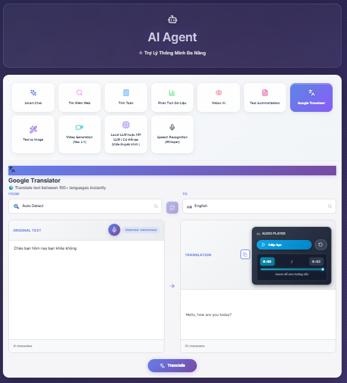  
*Google Translator interface with automatic language detection and instant translation.*

</div>

### ✨ Key features
- **Automatic language detection**
- **100+ languages supported**
- **User-friendly interface** with searchable language selector and country flags
- **Text-to-Speech** for translated text
- **Voice Input** for speech-based text entry
- **Swap Languages** to quickly switch source and target languages

### 🔧 Technology
- **Backend:** `googletrans` (Python) — a free wrapper for Google Translate
- **Frontend:** React with modern UI components and searchable language dropdown

### 📝 How to use
1. Select the source language (or choose “Auto Detect”)
2. Select the target language
3. Enter or speak the text to translate
4. Click “Translate” to view the result
5. Use the “Listen” button to hear the translation

### 💡 Notes
- `googletrans` uses the free Google Translate service
- No API key required; suitable for learning and experimentation
- For production, the official Google Cloud Translation API is recommended

---

## 14.🖼️ Text to Image (Clipdrop API)

### 📌 Overview
The **Text to Image** feature generates images from textual descriptions using the **Clipdrop API**.  
Suitable for use cases such as:
- AI image generation from prompts
- Rapid UI prototyping
- Creative content support (design, marketing, art, etc.)

---

### 🔐 Environment Configuration

Add the `CLIPDROP_API_KEY` environment variable to the `.env` file in the `backend/` directory:

```env
CLIPDROP_API_KEY=your_clipdrop_api_key_here
```

> ⚠️ **Notes:**
> - Do not commit the `.env` file to Git
> - Obtain the API key from Clipdrop’s official website

---

### 🚀 Example usage with `curl`

The example below sends a request to generate an image from a text prompt  
and saves the result as **`result.png`**:

```bash
curl -X POST https://clipdrop-api.co/text-to-image/v1 \
  -H "x-api-key: YOUR_API_KEY" \
  -F "prompt=shot of vaporwave fashion dog in miami" \
  -o result.png
```

---

### 🖼️ Example output

<div align="center">

**📸 Image generated from a text prompt using the Clipdrop API**

<br/>
  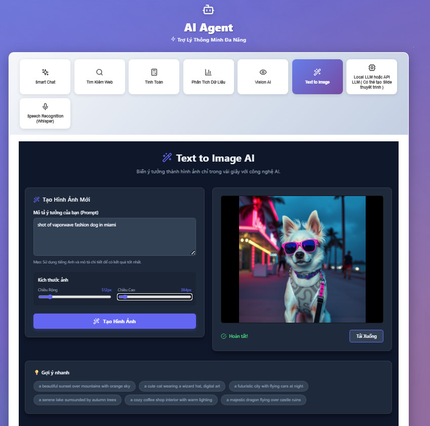
</div>

---

### 🧠 Additional notes
- More detailed prompts → more accurate images
- You can include style, lighting, and mood in prompts
- Suitable for backend services or internal tool integration

---

## 📦 Installation

### 1. Clone or download the project

```bash
cd "AI Agent"
```

### 2. Create a virtual environment (recommended)

```bash
python -m venv venv

# Windows
venv\Scripts\activate

# Linux/Mac
source venv/bin/activate
```

### 3. Install dependencies

```bash
pip install -r requirements.txt
```

### 4. Configure API keys

Copy `.env.example` to `.env`:

```bash
copy .env.example .env
```

Edit `.env` and fill in the API keys:

```env
# Required
GEMINI_API_KEY=your_gemini_api_key_here

# Optional (for Wolfram computation)
WOLFRAM_APP_ID=your_wolfram_app_id_here

# Optional (if using SerpAPI)
SERPAPI_KEY=your_serpapi_key_here

# Default search engine
SEARCH_ENGINE=duckduckgo

CLIPDROP_API_KEY=your_clipdrop_api_key
```
### 📝 Get API Keys

1. **Gemini API** (Required):
   - Visit: https://makersuite.google.com/app/apikey
   - Sign in with your Google account
   - Create a free API key

2. **Wolfram Alpha** (Optional):
   - Visit: https://products.wolframalpha.com/api/
   - Register an account
   - Get an App ID (free tier available)

3. **SerpAPI** (Optional):
   - Visit: https://serpapi.com/
   - Register an account
   - Get an API key (100 free searches/month)

## 🚀 Detailed Running Guide

### 🎯 Method 1: Manual Run (Recommended)

#### **Step 1: Install Python Dependencies**

```bash
# Make sure you are in the project root directory
cd "AI Agent"

# Install all required libraries
pip install -r requirements.txt
```

**Verify successful installation:**
```bash
pip list | grep google-genai
pip list | grep fastapi
```

#### **Step 2: Create and Configure the .env File**

```bash
# Copy the example file
copy .env.example .env     # Windows
# or
cp .env.example .env       # Linux/Mac
```

**Edit the `.env` file** using your favorite text editor:

```env
# Required - Gemini AI (Get from: https://makersuite.google.com/app/apikey)
GEMINI_API_KEY=your_actual_key_here

# Optional - Wolfram Alpha (Get from: https://products.wolframalpha.com/api/)
WOLFRAM_APP_ID=XXXXX-XXXXXXXXXX

# Optional - SerpAPI (Get from: https://serpapi.com/)
SERPAPI_KEY=your_serpapi_key_here

# Default search engine
SEARCH_ENGINE=duckduckgo
```

#### **Step 3: Run CLI Agent (Command Line Version)**

```bash
# Run interactive agent in terminal
python agent.py
```

**You will see:**
```
🤖 AI Agent has been initialized!
📡 Search Engine: DuckDuckGo
🧮 Wolfram Alpha: ✓

============================================================
🤖 AI AGENT - Interactive Mode
============================================================

Special commands:
  /search <engine> - Change search engine (duckduckgo/serpapi)
  /clear - Clear conversation history
  /exit or /quit - Exit
...
👤 You: _
```

**Usage examples:**
```
👤 You: Search for information about AI
👤 You: Calculate the integral of x^2 from 0 to 10
👤 You: Analyze the file data.csv
```

---

### 🌐 Method 2: Run Web Application (React + FastAPI)

#### **Step 1: Run Backend (FastAPI)**

Open **Terminal 1**:

```bash
# Navigate to backend directory
cd backend

# Install dependencies (only once)
pip install -r requirements.txt

# Run backend server
python main.py
```

**✅ Backend will run at:** `http://localhost:8000`

**Check backend status:**
- Visit: http://localhost:8000
- Or: http://localhost:8000/health

You will see:
```
INFO:     Uvicorn running on http://0.0.0.0:8000
INFO:     Started server process
```

#### **Step 2: Run Frontend (React)**

Open **Terminal 2** (keep backend terminal running):

```bash
# Navigate to frontend directory
cd frontend

# Install Node.js dependencies (only once)
npm install

# Run React development server
npm start
```

**✅ Frontend will automatically open at:** `http://localhost:3000`

The browser will automatically open the web application!

#### **Step 3: Use the Web Application**

The web interface has 3 main tabs:

1. **🔍 Web Search**
   - Choose DuckDuckGo or SerpAPI
   - Enter a question and receive answers from AI

2. **🧮 Calculation**
   - Enter mathematical expressions
   - Wolfram Alpha processes and AI explains

3. **📊 Data Analysis**
   - Drag & drop CSV files
   - View statistics and generate charts

---

### 🚀 Method 3: Automatic Run (Using Script)

If you want to run both backend and frontend at the same time:

```bash
# Windows
start.bat

# Linux/Mac
chmod +x start.sh
./start.sh
```

The script will automatically:
- ✅ Check and copy the .env file
- ✅ Install dependencies
- ✅ Run backend (port 8000)
- ✅ Run frontend (port 3000)

---

## 🛑 Stop the Application

### Stop CLI Agent:
```
Press Ctrl + C in terminal
or type: /exit
```

### Stop Web Application:
- **Backend:** Press `Ctrl + C` in backend terminal
- **Frontend:** Press `Ctrl + C` in frontend terminal

---

## 🔍 Troubleshooting & Debugging

### Check if Backend is running:
```bash
# Open in browser
http://localhost:8000/health

# Or use curl
curl http://localhost:8000/health
```

### Check if Frontend is running:
```bash
http://localhost:3000
```

### Error: "Port 8000 already in use"
```bash
# Windows - Find and kill process
netstat -ano | findstr :8000
taskkill /PID <PID_NUMBER> /F

# Linux/Mac
lsof -ti:8000 | xargs kill -9
```

### Error: "GEMINI_API_KEY is required"
```bash
# Check if .env file exists
ls .env          # Linux/Mac
dir .env         # Windows

# Check content
cat .env         # Linux/Mac
type .env        # Windows
```

### Error: "Module not found"
```bash
# Reinstall dependencies
pip install -r requirements.txt          # Backend
cd frontend && npm install               # Frontend
```

---

## 🚀 Usage

### Run Agent in Interactive Mode (CLI)

```bash
python agent.py
```

### Usage Examples

#### 1. Information Search

```
👤 You: Search for information about artificial intelligence
🤖 Agent: [Will search and return results from DuckDuckGo/SerpAPI]
```

#### 2. Mathematical Calculation

```
👤 You: Calculate the integral of x^2 from 0 to 10
🤖 Agent: [Will use Wolfram Alpha for calculation]
```

```
👤 You: Solve the equation x^2 + 5x + 6 = 0
🤖 Agent: [Result from Wolfram Alpha]
```

#### 3. CSV Data Analysis

```
👤 You: Analyze my file sales_data.csv
🤖 Agent: [Load file and display statistics]
```

```
👤 You: Create a bar chart for monthly sales
🤖 Agent: [Create bar chart and save to charts/ directory]
```

### Special Commands

- `/search duckduckgo` - Switch to DuckDuckGo
- `/search serpapi` - Switch to SerpAPI
- `/clear` - Clear conversation history
- `/exit` or `/quit` - Exit the program

## 📁 Project Structure

```
AI Agent/
│
├── agent.py                 # Main file to run agent
├── config.py               # Configuration and API key management
├── requirements.txt        # Required libraries
├── .env.example           # Example configuration file
├── .env                   # Actual configuration file (do not commit)
│
├── tools/                 # Tools directory
│   ├── __init__.py
│   ├── web_search.py     # Web search tool
│   ├── wolfram_tool.py   # Wolfram calculation tool
│   └── data_analysis.py  # Data analysis tool
│
└── charts/               # Chart output directory (auto-created)
```

## 🎯 Internal Agent Commands

The agent automatically detects and executes the following commands:

### Search
```
[SEARCH: <search query>]
```

### Calculation
```
[WOLFRAM: <calculation>]
```

### CSV Analysis
```
[LOAD_CSV: <file path>]
[CSV_INFO]
[CSV_ANALYZE: <column name>]
[CREATE_CHART: type=bar, x=month, y=sales, title=Monthly Sales]
```

## 💡 Tips

1. **More accurate searching**: Be specific in your questions
   - ❌ "Search Python"
   - ✅ "Search Python tutorial for beginners"

2. **Complex calculations**: Wolfram Alpha is very powerful
   - Integrals, derivatives
   - Equation solving
   - Statistics
   - Mathematical plotting

3. **Data analysis**: Prepare clean CSV files
   - Clear column names
   - Clean data, no errors
   - Standard formatting

## 🔧 Advanced Configuration

### Modify in `config.py`

```python
# Maximum CSV file size (MB)
MAX_CSV_SIZE_MB = 100

# Chart output directory
CHART_OUTPUT_DIR = "charts"

# Default search engine
SEARCH_ENGINE = "duckduckgo"  # or "serpapi"
```

## 🐛 Error Handling

### Common errors:

1. **"GEMINI_API_KEY is required"**
   - Check if the `.env` file exists
   - Make sure the API key is entered correctly

2. **"Wolfram Alpha is unavailable"**
   - Check WOLFRAM_APP_ID in `.env`
   - Calculation features will be disabled if missing

3. **"CSV file too large"**
   - Default limit is 100MB
   - Increase `MAX_CSV_SIZE_MB` in config if needed

## **PUBLIC ID USING NGROK (EXPOSE APPLICATION TO THE INTERNET)**

1. **Download and install**

- Visit: https://ngrok.com/download and choose the Windows version.
- Extract to get `ngrok.exe`.
- Tip: To run `ngrok` anywhere, copy `ngrok.exe` to `C:\Windows\System32` or add it to `PATH`.

2. **Get API Key (Authtoken)**

- Login: https://dashboard.ngrok.com/get-started/your-authtoken
- Copy the value under "Your Authtoken".

3. **Configure token (authentication)**

Open CMD/PowerShell/Git Bash and run:

```bash
ngrok config add-authtoken <PASTE_YOUR_TOKEN_HERE>
```

Successful output will show: "Authtoken saved...".

4. **Expose application (public tunnel)**

- Assume the app runs on port `3000`. To avoid `Invalid Host Header`, use:

```bash
ngrok http 3000 --host-header="localhost:3000"
```

(Replace `3000` with your actual port.)

5. **Get link and debug**

- Copy the public URL (e.g. `https://xxxx.ngrok-free.dev`) and share.
- View request/response details at ngrok web UI: `http://localhost:4040`.
<figure style="display: inline-block; text-align: center; margin: 20px;">
  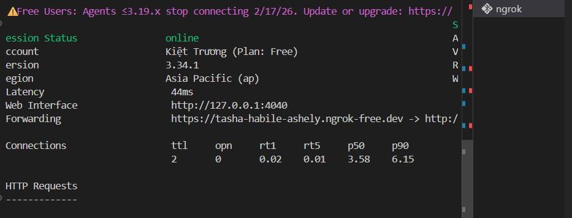
  <figcaption><strong>Figure 1:</strong> Terminal when ngrok runs successfully</figcaption>
</figure>

<figure style="display: inline-block; text-align: center; margin: 20px;">
  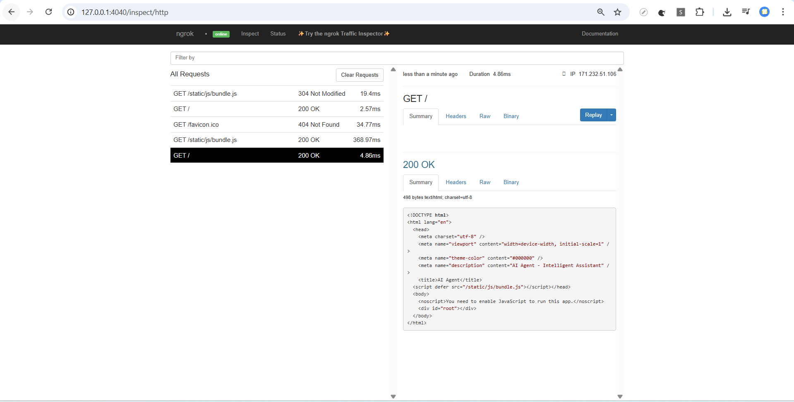
  <figcaption><strong>Figure 2:</strong> Ngrok API debug interface (http://localhost:4040)</figcaption>
</figure>

> **Security note:** When sharing links, only expose necessary routes and avoid leaking sensitive endpoints.

## 🌐 Using Cloudflare Tunnel (cloudflared)

Besides Ngrok, you can also use Cloudflare Tunnel to securely expose your local application (on your machine) to the Internet, similar to LocalTunnel but more professional and stable.

<div align="center">

  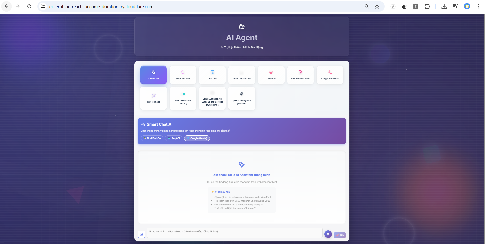
  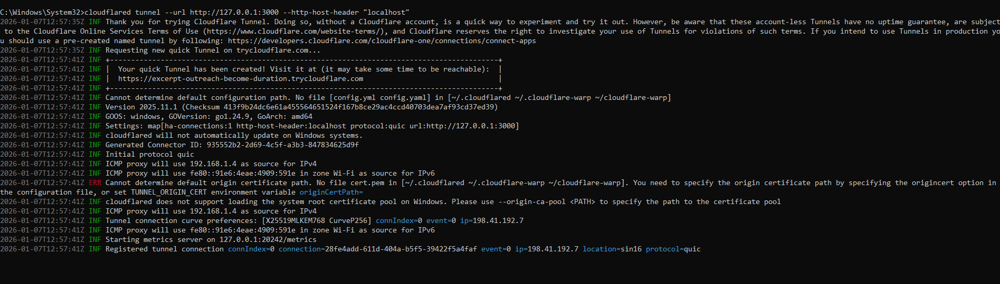

</div>

Here is an example command to run a Cloudflare tunnel:

```bash
cloudflared tunnel --url http://127.0.0.1:3000 --http-host-header "localhost"
```

Note: Replace `3000` with your application port if needed.

---
## 📄 License

**MIT License** – You are free to **use, modify, and share** this project.  
> 💡 Remember to keep the original copyright notice when redistributing.

---

## 🤝 Contributing

We welcome all contributions!  
You can:

- 🛠 Create a **Pull Request** to add features or fix bugs
- 🐛 Create an **Issue** to report bugs or suggest improvements
- 💬 Join discussions and share ideas

> Every contribution is valuable and helps improve the project! ✨

---

## 📞 Contact

If you encounter issues or have questions:

- 📨 Create an **Issue** on [GitHub](https://github.com/Kietnehi/AI-AGENT/issues)  
- 💌 Or send an email to: `truongquockiet1211@gmail.com` (optional)

> I will respond as soon as possible!

---

## 🔗 Author's GitHub

<div align="center">


<p align="center">
  <a href="https://github.com/Kietnehi">
    
  </a>
</p>

<h3>🚀 Truong Phu Kiet</h3>

<a href="https://github.com/Kietnehi">
  
</a>

<br/><br/>

<p align="center">
  
  
</p>

<h3>🛠 Tech Stack</h3>
<p align="center">
  <a href="https://skillicons.dev">
    
  </a>
</p>

<br/>

<h3>🌟 AI Agent Using Multimodal Open-Source Models & APIs </h3>
<p align="center">
  <a href="https://github.com/Kietnehi/AI-AGENT">
    
    
    
  </a>
</p>
<!-- Dynamic quote -->
<p align="center">
  
</p>
<p align="center">
  <i>Thank you for visiting! Don’t forget to click <b>⭐️ Star</b> to support the project.</i>
</p>


</div>
